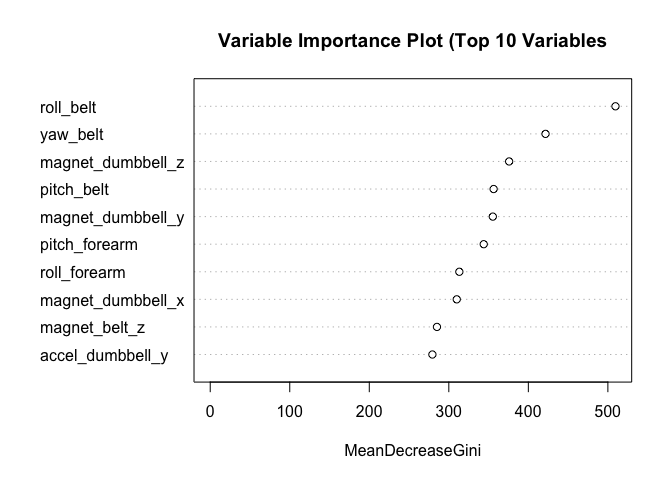

# Practical Machine Learning Course Project
Jarrett Meyer  
10/18/2016  


## Background

Using devices such as Jawbone Up, Nike FuelBand, and Fitbit it is now possible to collect a large amount of data about personal activity relatively inexpensively. These type of devices are part of the quantified self movement – a group of enthusiasts who take measurements about themselves regularly to improve their health, to find patterns in their behavior, or because they are tech geeks. One thing that people regularly do is quantify how much of a particular activity they do, but they rarely quantify how well they do it. In this project, your goal will be to use data from accelerometers on the belt, forearm, arm, and dumbell of 6 participants. They were asked to perform barbell lifts correctly and incorrectly in 5 different ways. More information is available from the website here: http://groupware.les.inf.puc-rio.br/har (see the section on the Weight Lifting Exercise Dataset).

## Data

The training data for this project are available here:

https://d396qusza40orc.cloudfront.net/predmachlearn/pml-training.csv

The test data are available here:

https://d396qusza40orc.cloudfront.net/predmachlearn/pml-testing.csv

The data for this project come from this source: http://groupware.les.inf.puc-rio.br/har. If you use the document you create for this class for any purpose please cite them as they have been very generous in allowing their data to be used for this kind of assignment.


```r
dat.training.url <- "https://d396qusza40orc.cloudfront.net/predmachlearn/pml-training.csv"
dat.testing.url <- "https://d396qusza40orc.cloudfront.net/predmachlearn/pml-testing.csv"
dat.training.path <- "./data/pml-training.csv"
dat.testing.path <- "./data/pml-testing.csv"
if (!dir.exists("./data")) {
  dir.create("./data")
}
if (!file.exists(dat.training.path)) {
  download.file(dat.training.url, dat.training.path)
}
if (!file.exists(dat.testing.path)) {
  download.file(dat.testing.url, dat.testing.path)
}
```

Load the data and save the dimensions.


```r
dat.training.frame <- read.csv(dat.training.path, stringsAsFactors = FALSE)
dat.training.dim <- dim(dat.training.frame)
dat.testing.frame <- read.csv(dat.testing.path, stringsAsFactors = FALSE)
dat.testing.dim <- dim(dat.testing.frame)
```

The training data consists of 19622 observations of 160 variables.

The testing data consists of 20 observations of 160 variables. The `classe` column is missing from the test data set, and an additional `problem_id` column has been added.


```r
table(dat.training.frame$classe)
```

```
## 
##    A    B    C    D    E 
## 5580 3797 3422 3216 3607
```

Per the documentation, "Class A corresponds to the specified execution of the exercise, while the other 4 classes correspond to common mistakes."

## Sanitizing the Data


There are several metadata columns provided in the data that we would first like to remove. We do not want these columns to have an impact on our model.


```r
remove_columns <- grep("^X|user_name|timestamp|window", colnames(dat.training.frame))
dat.training.frame <- dat.training.frame[, -remove_columns]
dat.testing.frame <- dat.testing.frame[, -remove_columns]
rm(remove_columns)
```

There are several invalid values, including empty strings, and `#DIV/0!` values. These are not useful for classification. Let's write a scrub function to remove these values.


```r
scrub_value <- function (x) {
  if (is.na(x) || x %in% c("", "#DIV/0!")) {
    NA
  }
  else {
    x
  }
}
scrub_frame <- function (x) {
  for (col in 1:ncol(x)) {
    x[, col] <- sapply(x[, col], scrub_value)
  }
  x
}
dat.training.frame <- scrub_frame(dat.training.frame)
dat.testing.frame <- scrub_frame(dat.testing.frame)
```

Finally, let's ensure that all columns, except for the `classe` column, are converted to `numeric` values.


```r
dat.training.frame$classe <- as.factor(dat.training.frame$classe)
cast_frame_to_numeric <- function (x) {
  for (col in colnames(x)) {
    if (col == "classe" || col == "problem_id") {
      # skip
    }
    else {
      x[, col] <- as.numeric(x[, col])       
    }
  }
  x
}
dat.training.frame <- cast_frame_to_numeric(dat.training.frame)
dat.testing.frame <- cast_frame_to_numeric(dat.testing.frame)
```

We wish to remove any columns that are more than 70% `NA` values. These should not be used as predictors.


```r
remove_na_columns <- function (x, threshold = na_threshold) {
  col_count <- ncol(x)
  row_count <- nrow(x)
  for (col in colnames(x)) {
    if (sum(is.na(x[, col])) > threshold * row_count) {
      x[, col] <- NULL
    }
  }
  print(paste0("Removed ", col_count - ncol(x), " columns."))
  x
}
dat.training.frame <- remove_na_columns(dat.training.frame)
```

```
## [1] "Removed 100 columns."
```

## Creating the Model


Split our training data into a training and testing set.


```r
in_train <- createDataPartition(dat.training.frame$classe, p = 0.7, list = FALSE)
train_data <- dat.training.frame[in_train, ]
test_data <- dat.training.frame[-in_train, ]
```

This gives us 13737 rows in our training set and 5885 rows in our testing set.

We will create a random forest model with 200 trees. We are using cross validation for training control, with 5 folds. Random forests allow for very accurate predictions, at the cost of time.


```r
control_validation <- trainControl(method = "cv", number = num_folds)
model_rf <- train(classe ~ ., data = train_data, method = "rf",
                  trControl = control_validation, nTree = num_trees)
print(model_rf)
```

```
## Random Forest 
## 
## 13737 samples
##    52 predictor
##     5 classes: 'A', 'B', 'C', 'D', 'E' 
## 
## No pre-processing
## Resampling: Cross-Validated (5 fold) 
## Summary of sample sizes: 10988, 10990, 10990, 10990, 10990 
## Resampling results across tuning parameters:
## 
##   mtry  Accuracy   Kappa    
##    2    0.9901727  0.9875674
##   27    0.9897362  0.9870144
##   52    0.9822380  0.9775248
## 
## Accuracy was used to select the optimal model using  the largest value.
## The final value used for the model was mtry = 2.
```


```r
predict_rf <- predict(model_rf, newdata = test_data)
conf_mat_rf <- confusionMatrix(test_data$classe, predict_rf)
print(conf_mat_rf)
```

```
## Confusion Matrix and Statistics
## 
##           Reference
## Prediction    A    B    C    D    E
##          A 1674    0    0    0    0
##          B   10 1125    4    0    0
##          C    0    6 1018    2    0
##          D    0    0   12  952    0
##          E    0    0    0    2 1080
## 
## Overall Statistics
##                                           
##                Accuracy : 0.9939          
##                  95% CI : (0.9915, 0.9957)
##     No Information Rate : 0.2862          
##     P-Value [Acc > NIR] : < 2.2e-16       
##                                           
##                   Kappa : 0.9923          
##  Mcnemar's Test P-Value : NA              
## 
## Statistics by Class:
## 
##                      Class: A Class: B Class: C Class: D Class: E
## Sensitivity            0.9941   0.9947   0.9845   0.9958   1.0000
## Specificity            1.0000   0.9971   0.9984   0.9976   0.9996
## Pos Pred Value         1.0000   0.9877   0.9922   0.9876   0.9982
## Neg Pred Value         0.9976   0.9987   0.9967   0.9992   1.0000
## Prevalence             0.2862   0.1922   0.1757   0.1624   0.1835
## Detection Rate         0.2845   0.1912   0.1730   0.1618   0.1835
## Detection Prevalence   0.2845   0.1935   0.1743   0.1638   0.1839
## Balanced Accuracy      0.9970   0.9959   0.9914   0.9967   0.9998
```

Our model, tested against the untrained validation set, is 99.39% accurate.


```r
num_vars <- 10
varImpPlot(model_rf$finalModel, 
           main = paste0("Variable Importance Plot (Top ", num_vars, " Variables"),
           n.var = num_vars)
```

<!-- -->

## Test Results


```r
test_predictions <- predict(model_rf, newdata = dat.testing.frame)
test_predictions <- data.frame(dat.testing.frame$problem_id, test_predictions)
colnames(test_predictions) <- c("problem_id", "prediction")
print(test_predictions)
```

```
##    problem_id prediction
## 1           1          B
## 2           2          A
## 3           3          B
## 4           4          A
## 5           5          A
## 6           6          E
## 7           7          D
## 8           8          B
## 9           9          A
## 10         10          A
## 11         11          B
## 12         12          C
## 13         13          B
## 14         14          A
## 15         15          E
## 16         16          E
## 17         17          A
## 18         18          B
## 19         19          B
## 20         20          B
```
